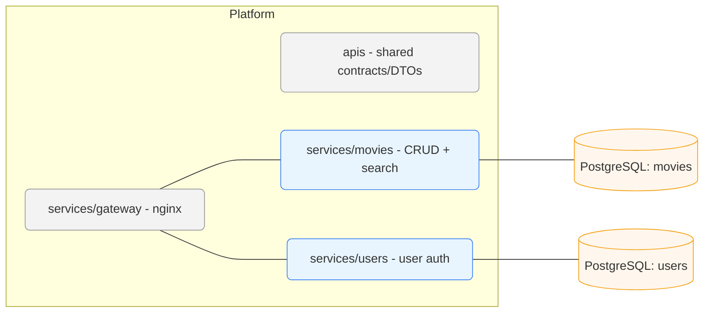

# 🎬 Movies Platform

A modular Java 21 + Spring Boot platform for managing and exploring movie data. It’s designed as a small, service-oriented system you can run locally with Docker, and extend with more services (users, reviews, recommendations) over time.

---
Table of Contents

- [Architecture](#architecture)
- [Prerequisites](#prerequisites)
- [Tech Stack](#tech-stack)
- [Quick start (Docker)](#quick-start-docker)
- [Local development](#local-development)
- [API docs](#api-docs)
- [Quality & tooling](#quality--tooling)
- [Running migrations](#running-migrations)
- [License](#license)
---

## Architecture
The platform is built using Java 21 and Spring Boot, leveraging a microservices architecture. It consists of the following modules:


Project layout
```
.
├─ apis/                 # Shared contracts & DTOs
├─ services/
│  ├─ gateway/           # Nginx gateway (API routing, static content)
│  ├─ movies/            # Movie service (CRUD, search, ext. API integrations)
│  ├─ users/             # User service (accounts/authn plumbing)
|  └─ telemetry/         # (Optional) Telemetry service (OpenTelemetry, Prometheus)
├─ infra/                # (Infra configs, Docker bits, scripts)
├─ .env.*.example        # Example env files for dev/docker/test
├─ docker-compose.yaml   # Local orchestration
├─ pom.xml               # Maven multi-module root
└─ README.md
```
---

## Prerequisites

* Java 21
* Maven 3.9+
* Docker & Docker Compose (for the quickest path)

## Tech Stack
### Languages & Runtime
- Java 21
- Maven 3.9+

### Frameworks & Libraries
- Spring Boot 3.3.x (core app framework)
- Spring Web (REST API)
- Spring Boot OpenAPI (Swagger integration)

### Persistence
- PostgreSQL 16
- Flyway for database migrations
- Spring Data JPA (ORM)

### Resiliency & Observability
- Resilience4j (rate limiter)
- Spring Boot Actuator (monitoring)
- OpenTelemetry + Prometheus + Grafana

### DevOps & Tooling
- Docker & Docker Compose
- Pre-commit hooks (formatting, linting)

### Testing
- JUnit 5
- Mockito

## Quick start (Docker)

This brings up PostgreSQL plus the services defined in the repo’s docker-compose.yaml.

1) Clone the repository
```bash
git clone https://github.com/gbessonov/movies_platform.git
cd movies_platform
```
2) Copy env templates and adjust values (see "Configuration" below)
```bash
cp .env.docker.example .env.docker || true
cp .env.dev.example .env.dev || true
```
4) Start everything
```bash
docker compose up -d
```
5) Tail logs
```bash
docker compose logs -f
```

Once started, services will expose REST endpoints (see API docs).

## Local development

Run databases with Docker, then run services from your IDE.

Start infra only (DBs etc.), as defined in docker-compose.yaml
```bash
docker compose up -d db-movies db-users
```
In your IDE:
1. Import as a Maven multi-module project.
2. Start DBs with Docker (see above).
3. Run services/movies and services/users Spring Boot apps with your local .env.dev values.

## API docs

Each service exposes REST endpoints (e.g., /api/*, /actuator).

You can find:
* Swagger UI at http://localhost:<port>/swagger-ui
* OpenAPI JSON at http://localhost:<port>/v3/api-docs

## Quality & tooling

Java formatting & linting via your IDE plus the repo’s pre-commit configuration.


Enable Git hooks:
```bash
# Install pre-commit via pipx or pip [One time]
pipx install pre-commit || pip install pre-commit
# Install pre-commit hooks in the repo [Per repo]
pre-commit install
pre-commit run -a
```
Tests

```
mvn verify
```

## Running migrations

It is possible to run migrations via Maven against each database.

Movies DB
```bash
mvn -pl services/movies -am clean flyway:migrate \
-Dflyway.url=jdbc:postgresql://localhost:5432/movies \
-Dflyway.user=movies_user \
-Dflyway.password=***
```

Users DB
```bash
mvn -pl services/users -am clean flyway:migrate \
-Dflyway.url=jdbc:postgresql://localhost:5431/users \
-Dflyway.user=users_user \
-Dflyway.password=***
```

## License

This project is licensed under the MIT License.
